# Devika Agent Main Codebase Analysis
## SYNTHIA 4.2 Architecture and Components

**Analysis Date:** 2026-02-18  
**Project:** Devika Agent Main with SYNTHIA 4.2  
**Location:** c:/devika-agent-main/devika-agent-main/

---

## 1. Overall Architecture

SYNTHIA 4.2 is an advanced autonomous AI coding agent built on top of the Devika codebase. The architecture follows a modular, multi-layered approach:

```mermaid
graph TB
    A[User Request] --> B{SYNTHIA Core}
    B --> C[Memory Layer]
    B --> D[Investigation Engine]
    B --> E[Design System]
    B --> F[Execution Engine]
    B --> G[Quality Gates]
    B --> H[Agent Swarm]
    
    C --> C1[Project Memory]
    C --> C2[Team Memory]
    C --> C3[Global Memory]
    C --> C4[Archon X Sync]
    
    D --> D1[Repository Scanner]
    D --> D2[Niche Detector]
    D --> D3[Architecture Analyzer]
    D --> D4[Strategic Planner]
    
    E --> E1[UI/UX Pro Max]
    E --> E2[Awwwards Integration]
    E --> E3[Theme Generator]
    E --> E4[Design Styles]
    
    F --> F1[Code Generator]
    F --> F2[Hero Creator]
    F --> F3[Content Generator]
    F --> F4[Performance Optimizer]
    
    G --> G1[Lighthouse CI]
    G --> G2[Accessibility Validator]
    G --> G3[Security Scanner]
    G --> G4[Visual Regression]
    
    H --> H1[Architect Agent]
    H --> H2[Documenter Agent]
    H --> H3[Security Agent]
    H --> H4[Tester Agent]
    H --> H5[AST Agent]
```



---

## 2. Major Components and Interactions

### 2.1 Core System
- **Entry Point:** `devika.py` - Flask API server with Socket.IO integration
- **Core Orchestrator:** `src/synthia/core.py` - Central nervous system managing agent operations
- **Execution Orchestrator:** `src/synthia/orchestrator.py` - Ralphy + Agent Lightning integration
- **State Management:** `src/state.py` - Agent state tracking

### 2.2 Memory System (`src/synthia/memory.py`)
- **Multi-layer persistent memory:** PROJECT → TEAM → GLOBAL
- **Archon X integration:** Webhook-based knowledge synchronization
- **SQLite backend:** Local memory storage
- **Git-like version control:** Track changes across sessions

### 2.3 Investigation Engine (`src/synthia/investigation/`)
- **Repository Scanner:** Deep recursive scan with SVG analysis
- **Niche Detector:** AI-powered niche classification (50+ niches)
- **Architecture Analyzer:** Component dependency mapping
- **Strategic Planner:** Task prioritization with risk assessment

### 2.4 Design System (`src/synthia/design/`)
- **50+ design styles:** From UI/UX Pro Max integration
- **97 color palettes:** Professional color combinations
- **57 font pairings:** Typography presets
- **Awwwards integration:** Trend analysis and pattern recognition
- **Theme Generator:** Dynamic theme creation based on niche

### 2.5 Agent Team (`src/synthia/agents/`)
- **Architect Agent:** Architecture design and planning
- **Documenter Agent:** Code documentation generation
- **Security Agent:** Vulnerability scanning and secret detection
- **Tester Agent:** Test generation and execution
- **AST Agent:** Abstract syntax tree analysis

### 2.6 Execution Engine (`src/synthia/execution/`)
- **Ralphy Execution:** Priority-based task management
- **Retry Logic:** Automatic retry on task failure
- **Parallel Execution:** Multi-agent coordination
- **Quality Gates:** Lighthouse, accessibility, security checks

### 2.7 Agent Lightning Integration (`src/synthia/trainer/`)
- **Mentor System:** Observes and improves SYNTHIA's performance
- **Quality Gates:** Lighthouse CI (95+ score), WCAG 2.1 AA accessibility
- **Continuous Learning:** Feedback loop for prompt and decision tree optimization

### 2.8 Security System (`src/security/`, `src/synthia/agents/security.py`)
- **ACIP Integration:** Prompt injection detection and sanitization
- **Secret Detection:** 20+ secret patterns (AWS, GitHub, Stripe, etc.)
- **Vulnerability Scanning:** SQL injection, XSS, command injection detection
- **Dependency Checks:** Vulnerable package detection

---

## 3. Gaps and Incomplete Features

### 3.1 Pending Phases (from SYNTHIA-REPORT.md)
| Phase | Status | Completion |
|-------|--------|------------|
| Phase 1: Core Integration | Complete | 100% |
| Phase 2: Investigation Engine | Complete | 100% |
| Phase 3: UI/UX Pro Max | Complete | 100% |
| **Phase 4: Execution Engine** | **Pending** | **0%** |
| **Phase 5: Quality Gates** | **Pending** | **0%** |
| **Phase 6: Agent Swarm** | **Pending** | **0%** |
| **Phase 7: Deployment** | **Pending** | **0%** |

### 3.2 Key Gaps Identified

#### 3.2.1 Execution Engine
- No autonomous code generation implementation
- No hero section creator
- No content generation system
- No performance optimizer
- No Unsplash API integration for professional imagery
- No SVG generation and manipulation

#### 3.2.2 Quality Gates
- No Lighthouse CI integration
- No WCAG 2.1 AA accessibility validator
- No visual regression testing
- No automated testing framework

#### 3.2.3 Agent Swarm
- No sub-agent factory
- No task delegation system
- No agent communication protocol
- No swarm coordination

#### 3.2.4 Deployment
- No deployment automation (Vercel, Netlify, Coolify)
- No monitoring dashboard
- No learning feedback loop
- No rollback mechanisms

#### 3.2.5 UI/UX
- Frontend is Svelte-based but lacks advanced UI components
- No real-time collaboration features
- No dark/light theme support
- Limited responsive design

#### 3.2.6 Documentation
- Experts directory contains only placeholders (`__UNIMPLEMENTED__`)
- No comprehensive API documentation
- Limited examples and tutorials

---

## 4. Security Vulnerabilities and Potential Issues

### 4.1 ACIP Integration (`src/security/acip_integration.py`)
- **Weak pattern matching:** Relies on simple regex patterns
- **Limited jailbreak detection:** Only checks for "ignore previous" patterns
- **No machine learning models:** No advanced prompt injection detection

### 4.2 Security Agent (`src/synthia/agents/security.py`)
- **Pattern-based detection:** Relies on regex patterns that can be bypassed
- **Limited secret patterns:** Only 20+ patterns defined
- **No dependency vulnerability scanning:** Does not check for vulnerable packages
- **No dynamic analysis:** Static analysis only

### 4.3 Sandboxing (`src/sandbox/`)
- **Firejail integration:** Linux-only sandboxing
- **No Windows/macOS support:** Cross-platform compatibility issues
- **Limited isolation:** Potential for container escape

### 4.4 API Security (`src/apis/`)
- **CORS configuration:** Hardcoded origins (`localhost:3000`)
- **No API key authentication:** Open API endpoints
- **No rate limiting:** Potential for denial of service attacks

### 4.5 Dependencies (`requirements.txt`)
- **Outdated packages:** Potential security vulnerabilities
- **No dependency locking:** `requirements.txt` without versions
- **Limited security auditing:** No automated dependency scanning

---

## 5. 3D Logic Implementation

### Current Status: **NO 3D LOGIC IMPLEMENTED**

**Search Results:**
- No mentions of "3d", "three.js", "webgl", or "canvas3d" in the codebase
- No 3D rendering libraries in dependencies
- No 3D-related components in the UI
- No 3D model processing capabilities

### Implications:
- SYNTHIA cannot handle 3D graphics or models
- No support for 3D game development
- No 3D visualization capabilities
- No 3D printing or CAD integration

---

## 6. Technology Stack

### Backend:
- **Language:** Python 3.8+
- **Framework:** Flask + Socket.IO
- **LLM Integration:** OpenAI, Claude, Gemini, Groq, Ollama, LM Studio, Mistral
- **Database:** SQLite
- **Version Control:** Git
- **Containerization:** Docker

### Frontend:
- **Language:** JavaScript (Svelte)
- **Build Tool:** Vite
- **Styling:** Tailwind CSS
- **UI Library:** Custom Svelte components
- **Icons:** Lucide icons

### Tools and Services:
- **Code Execution:** Firejail sandboxing
- **Browser Automation:** Playwright (via browser module)
- **Git Integration:** GitHub API
- **Deployment:** Netlify (planned)
- **Knowledge Sync:** Archon X webhooks

---

## 7. Files and Directories Structure

```
devika-agent-main/
├── devika.py                    # Main entry point - Flask API server
├── requirements.txt            # Python dependencies
├── setup.sh                     # Setup script
├── sample.config.toml          # Configuration template
├── docker-compose.yaml         # Docker configuration
├── app.dockerfile              # App container
├── devika.dockerfile           # Devika container
├── README.md                   # Documentation
├── SYNTHIA-REPORT.md          # SYNTHIA v4.2 features documentation
├── SYNTHIA-UNIFIED-PLAN.md    # Integration plan with Agent Lightning
├── ARCHITECTURE.md             # Technical architecture
├── .github/                    # GitHub workflows
├── .assets/                    # Images and assets
├── docs/                       # Documentation
├── benchmarks/                 # Performance benchmarks
├── beads/                      # Beads integration
├── ralphy-reference/           # Ralphy agent reference
├── src/
│   ├── init.py                 # Initialization
│   ├── config.py               # Configuration
│   ├── logger.py               # Logging
│   ├── project.py              # Project management
│   ├── state.py                # Agent state
│   ├── socket_instance.py      # Socket.IO
│   ├── agents/                 # Base agent implementations
│   ├── api/                    # API endpoints
│   ├── browser/                # Browser automation
│   ├── documenter/             # Documentation generation
│   ├── experts/                # Expert knowledge (placeholder)
│   ├── filesystem/             # File system operations
│   ├── integrations/           # External integrations
│   ├── llm/                    # LLM clients
│   ├── memory/                 # Knowledge base
│   ├── sandbox/                # Code execution sandbox
│   ├── security/               # Security checks
│   ├── services/               # External services (Git, GitHub, Netlify)
│   ├── synthia/                # SYNTHIA-specific modules
│   └── tools/                  # Utility tools
├── ui/                        # Frontend (Svelte)
└── tests/                     # Tests
```

---

## 8. Key Features Implemented

### Completed Features:
✅ **Multi-layer persistent memory** (PROJECT, TEAM, GLOBAL)  
✅ **Archon X webhook integration** for knowledge synchronization  
✅ **50+ design styles** with 97 color palettes and 57 font pairings  
✅ **Steve Krug's "Don't Make Me Think"** principles for mobile-first design  
✅ **Repository scanning** with SVG analysis and broken code detection  
✅ **Niche detection AI** for context-aware design decisions  
✅ **Strategic planning** with risk assessment and rollback procedures  
✅ **Security analysis** with vulnerability scanning and secret detection  
✅ **Multiple LLM support** (OpenAI, Claude, Gemini, etc.)  
✅ **Flask API with Socket.IO** for real-time communication  
✅ **Docker containerization** for easy deployment  

---

## 9. Performance Characteristics

### Current Metrics:
- **Memory:** SQLite backend with in-memory caching
- **Concurrency:** Gevent-based async processing
- **Parallel Execution:** ThreadPoolExecutor with 4 workers
- **Response Time:** ~5-10 seconds per agent step
- **Code Generation:** Not yet implemented

---

## 10. Development Roadmap

### Immediate Priorities (Next 4-6 weeks):
1. **Phase 4: Execution Engine** - Build code generation and content creation
2. **Phase 5: Quality Gates** - Implement Lighthouse CI and accessibility checks
3. **Security Enhancements** - Improve secret detection and vulnerability scanning
4. **Documentation** - Complete experts directory and API docs

### Mid-Term Goals (2-3 months):
1. **Phase 6: Agent Swarm** - Build multi-agent coordination
2. **Phase 7: Deployment** - Add Vercel/Netlify integration
3. **3D Logic** - Implement Three.js integration for 3D capabilities
4. **Real-Time Collaboration** - Add WebRTC-based collaboration

### Long-Term Vision:
- **Full Autonomy:** One-shot repository upgrades without human intervention
- **Universal Language Support:** Any programming language and framework
- **MCP Server Integration:** Dynamic tool creation and persistent memory
- **AI-Powered Design:** Awwwards-level UI/UX generation

---

## 11. Recommendations for Improvement

### Security:
1. Implement machine learning-based prompt injection detection
2. Add dependency vulnerability scanning (e.g., safety, pip-audit)
3. Improve secret detection with more patterns and entropy checks
4. Add API key authentication and rate limiting

### Performance:
1. Implement Redis for caching and session management
2. Add message queuing (Celery + RabbitMQ) for async tasks
3. Optimize repository scanning with parallel processing
4. Add performance monitoring (Prometheus + Grafana)

### Features:
1. Implement execution engine with code generation
2. Add quality gates for automated testing and validation
3. Build agent swarm coordination system
4. Add deployment automation and monitoring

### Documentation:
1. Complete experts directory with domain-specific knowledge
2. Add API documentation with Swagger/OpenAPI
3. Create example projects and tutorials
4. Add video demos and getting started guides

---

## 12. Conclusion

The Devika Agent Main codebase with SYNTHIA 4.2 represents a sophisticated AI coding agent with strong foundations in memory management, investigation, and design. The architecture is well-structured with clear separation of concerns.

### Strengths:
- **Robust memory system** with multi-layer persistence and Archon X integration
- **Advanced investigation capabilities** including niche detection and architecture analysis
- **Comprehensive design system** with 50+ styles and professional design patterns
- **Strong security focus** with ACIP integration and secret detection
- **Multiple LLM support** for flexibility

### Weaknesses:
- **Incomplete execution engine** - No code generation or content creation
- **Lack of quality gates** - No automated testing or validation
- **No agent swarm** - Limited multi-agent coordination
- **Basic security** - Pattern-based detection that can be bypassed
- **No 3D capabilities** - Cannot handle 3D graphics or models

### Overall Assessment:
SYNTHIA 4.2 is a promising AI coding agent with a solid architectural foundation. The core investigation and design capabilities are well-implemented, but the execution phase remains incomplete. With proper investment in the pending phases, SYNTHIA has the potential to become a world-class autonomous coding agent.

The codebase is well-organized and follows good software engineering practices. The modular design allows for easy extension and maintenance. However, the lack of implementation in the execution and quality gates phases means SYNTHIA is not yet ready for production use.