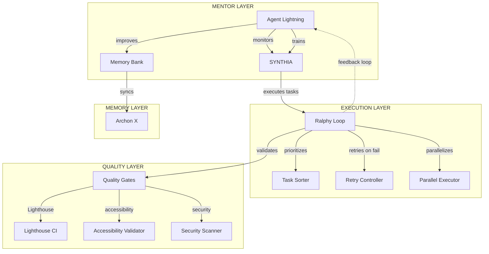

# 🚀 SYNTHIA 4.2 - Unified Execution Plan
## With Microsoft Agent Lightning Integration + Ralphy Flywheel

**Project:** SYNTHIA 4.2 Integration with Agent Zero (Kilo Code)  
**Source:** `git@github.com:executiveusa/agent-zero-Fork.git`  
**Status:** Unified Code Sprint - Ready for Execution  
**Created:** 2026-02-18

---

## 🎯 EXECUTIVE SUMMARY

Building the world's most advanced autonomous coding agent with **continuous learning** through Microsoft Agent Lightning integration:

| Component | Purpose |
|-----------|---------|
| **SYNTHIA Core** | Primary autonomous coding agent (built) |
| **Agent Lightning** | Mentor/trainer - monitors & improves SYNTHIA |
| **Ralphy Loop** | Execution pattern - task prioritization, retry logic, parallel execution |
| **Flywheel Effect** | Lightning watches SYNTHIA → learns → improves → watches again |

---

## 📐 UNIFIED ARCHITECTURE



---

## 🔄 RALPHY + AGENT LIGHTNING FLYWHEEL

### The Mandatory Workflow

```
┌─────────────────────────────────────────────────────────────────┐
│                    SYNTHIA EXECUTES TASK                       │
└────────────────────────────┬────────────────────────────────────┘
                             ▼
┌─────────────────────────────────────────────────────────────────┐
│              QUALITY GATES CHECK (Lighthouse + A11y)            │
│  ┌─────────────┐  ┌─────────────┐  ┌─────────────┐            │
│  │ Lighthouse  │  │ WCAG 2.1 AA │  │ Security    │            │
│  │   >95      │  │   Pass      │  │   Pass      │            │
│  └──────┬──────┘  └──────┬──────┘  └──────┬──────┘            │
└─────────┼─────────────────┼─────────────────┼───────────────────┘
          │                 │                 │
          ▼                 ▼                 ▼
┌─────────────────────────────────────────────────────────────────┐
│            AGENT LIGHTNING OBSERVATION                          │
│  ┌─────────────────────────────────────────────────────────┐   │
│  │ • Code quality metrics                                  │   │
│  │ • Pattern success rate                                   │   │
│  │ • Decision quality                                      │   │
│  │ • Memory retrieval accuracy                             │   │
│  └─────────────────────────────────────────────────────────┘   │
└────────────────────────────┬────────────────────────────────────┘
                             ▼
┌─────────────────────────────────────────────────────────────────┐
│              LIGHTNING TRAINS SYNTHIA                           │
│  ┌─────────────────────────────────────────────────────────┐   │
│  │ • Update prompt strategies                               │   │
│  │ • Refine memory patterns                                │   │
│  │ • Adjust quality thresholds                             │   │
│  │ • Improve decision trees                                │   │
│  └─────────────────────────────────────────────────────────┘   │
└────────────────────────────┬────────────────────────────────────┘
                             ▼
┌─────────────────────────────────────────────────────────────────┐
│              MEMORY SYNC TO ARCHON X                           │
│  ┌─────────────────────────────────────────────────────────┐   │
│  │ • Success patterns → Team Memory                        │   │
│  │ • Failure patterns → Learning Database                  │   │
│  │ • New strategies → Global Patterns                      │   │
│  └─────────────────────────────────────────────────────────┘   │
└────────────────────────────┬────────────────────────────────────┘
                             ▼
                    ┌───────────────┐
                    │ NEXT TASK     │
                    │ (IMPROVED)    │
                    └───────────────┘
```

---

## PHASE 0: AGENT LIGHTNING INTEGRATION (NEW)

### Objectives
- Add Microsoft Agent Lightning as mentor/trainer
- Create monitoring hooks throughout SYNTHIA
- Build training/feedback mechanisms
- Establish bidirectional communication

### Tasks

#### 0.1: Agent Lightning Core Integration
**Files Created:**
- `src/synthia/trainer/lightning_core.py`
- `src/synthia/trainer/monitor.py`
- `src/synthia/trainer/improver.py`
- `src/synthia/trainer/config.py`

**Implementation:**
```python
class AgentLightning:
    """Microsoft Agent Lightning - SYNTHIA's mentor and trainer"""
    
    def __init__(self, synthia_agent):
        self.synthia = synthia_agent
        self.metrics = PerformanceMetrics()
        self.learner = PatternLearner()
        self.observer = CodeQualityObserver()
        
    async def observe_task(self, task, result):
        """Monitor SYNTHIA executing a task"""
        # Collect metrics
        quality_score = await self.observer.assess(result)
        decision_quality = self.evaluate_decisions(task, result)
        memory_efficiency = self.metrics.measure_memory_usage()
        
        # Store observations
        await self.store_observation(Observation(
            task=task,
            result=result,
            metrics=Metrics(
                quality=quality_score,
                decisions=decision_quality,
                memory=memory_efficiency
            )
        ))
        
    async def train_synthia(self):
        """Train SYNTHIA based on observations"""
        patterns = await self.learner.extract_patterns()
        
        for pattern in patterns:
            if pattern.success_rate > 0.8:
                await self.synthia.memory.add_pattern(pattern)
            elif pattern.success_rate < 0.5:
                await self.synthia.avoid_pattern(pattern)
                
        await self.update_prompts()
        
    async def improve_codebase(self):
        """Make SYNTHIA better at her job"""
        improvements = await self.analyze_failures()
        for improvement in improvements:
            await self.apply_improvement(improvement)
```

#### 0.2: Monitoring Hooks
**Files Created:**
- `src/synthia/trainer/hooks/quality_hook.py`
- `src/synthia/trainer/hooks/memory_hook.py`
- `src/synthia/trainer/hooks/decision_hook.py`

**Implementation:**
```python
class QualityGateHook:
    """Automatic quality enforcement"""
    
    def __init__(self, thresholds: QualityThresholds):
        self.thresholds = thresholds
        
    async def before_code_generation(self, context):
        """Pre-execution quality check"""
        # Check memory for similar patterns
        patterns = await memory.search(context.goal)
        
        # Validate approach against known patterns
        if not self.validate_approach(context, patterns):
            raise QualityGateError("Approach validation failed")
            
    async def after_code_generation(self, code):
        """Post-execution quality check"""
        # Run Lighthouse
        lighthouse_score = await self.run_lighthouse(code)
        
        # Check accessibility
        a11y_score = await self.check_accessibility(code)
        
        # Verify security
        security_passed = await self.check_security(code)
        
        if not self.passes_all_thresholds(lighthouse_score, a11y_score, security_passed):
            raise QualityGateError(f"Quality gates failed: LH={lighthouse_score}, A11y={a11y_score}")
            
        return QualityResult(
            lighthouse=lighthouse_score,
            accessibility=a11y_score,
            security=security_passed
        )
```

#### 0.3: Improvement Engine
**Files Created:**
- `src/synthia/trainer/improver/pattern_improver.py`
- `src/synthia/trainer/improver/prompt_tuner.py`
- `src/synthia/trainer/improver/strategy_optimizer.py`

**Implementation:**
```python
class ImprovementEngine:
    """Agent Lightning's training logic"""
    
    async def analyze_and_improve(self):
        """Main improvement cycle"""
        # Get all recent observations
        observations = await self.get_recent_observations()
        
        # Identify patterns
        success_patterns = self.find_successes(observations)
        failure_patterns = self.find_failures(observations)
        
        # Generate improvements
        improvements = []
        
        # Pattern-based improvements
        for failure in failure_patterns:
            improvement = await self.create_pattern_fix(failure)
            improvements.append(improvement)
            
        # Prompt-based improvements  
        prompt_issues = await self.analyze_prompts(observations)
        improvements.extend(await self.fix_prompt_issues(prompt_issues))
        
        # Strategy improvements
        strategy_issues = await self.analyze_strategies(observations)
        improvements.extend(await self.optimize_strategies(strategy_issues))
        
        # Apply improvements
        for improvement in improvements:
            await self.apply_improvement(improvement)
            
        # Sync to Archon X
        await self.sync_to_archon_x(improvements)
```

---

## PHASE 1-3: COMPLETED ✓

### What Was Built

| Phase | Components | Status |
|-------|-----------|--------|
| Phase 1 | SYNTHIA Core, Memory, Webhook, Agent Registry | ✅ Complete |
| Phase 2 | Investigation Engine (Scanner, Niche Detector, Architect, Planner) | ✅ Complete |
| Phase 3 | Design System (UI/UX Pro Max, Awwwards, Steve Krug) | ✅ Complete |

---

## PHASE 4-7: UNIFIED CODE SPRINT

### Objectives
- Build execution engine with Ralphy patterns
- Implement quality gates with Lighthouse + Accessibility
- Create agent swarm orchestration
- Build deployment automation
- Add CLI tools for codebase management

### Tasks

#### 4.1: Ralphy Execution Engine Integration
**Files Created:**
- `src/synthia/execution/ralphy_engine.py`
- `src/synthia/execution/task_sorter.py`
- `src/synthia/execution/retry_controller.py`
- `src/synthia/execution/parallel_executor.py`

**Implementation:**
```python
class RalphyExecutionEngine:
    """Integrates Ralphy's execution patterns"""
    
    PRIORITY_ORDER = [
        "architectural",   # Core infrastructure
        "integration",     # API/Service connections
        "unknown",        # Complex/unproven
        "standard",       # Common patterns
        "polish"          # UI/UX refinements
    ]
    
    def __init__(self):
        self.retry_config = RetryConfig(
            max_retries=3,
            backoff="exponential",
            delay=2
        )
        self.parallel = ParallelExecutor(max_workers=3)
        
    async def execute_with_raphly_patterns(self, plan):
        """Execute tasks using Ralphy patterns"""
        # Sort by priority
        sorted_tasks = self.sort_by_priority(plan.tasks)
        
        results = []
        for task in sorted_tasks:
            # Execute with retry logic
            result = await self.execute_with_retry(task)
            results.append(result)
            
            # Notify Agent Lightning
            await self.lightning.observe_task(task, result)
            
            # Check quality gates
            if not await self.quality_gates.pass(result):
                # Retry with improvements
                result = await self.improve_and_retry(task, result)
                
        return results
        
    def sort_by_priority(self, tasks):
        """Ralphy's priority-based sorting"""
        priority_map = {t: self.PRIORITY_ORDER.index(t.type) for t in tasks}
        return sorted(tasks, key=lambda t: priority_map.get(t, 99))
```

#### 4.2: Code Generator with Memory Integration
**Files Created:**
- `src/synthia/execution/code_generator.py`
- `src/synthia/execution/ast_manipulator.py`
- `src/synthia/execution/svg_generator.py`

**Implementation:**
```python
class UnifiedCodeGenerator:
    """Memory-first code generation with Ralphy patterns"""
    
    def __init__(self):
        self.memory = MultiLayerMemory()
        self.llm = LLMAdapter()
        self.validator = CodeValidator()
        
    async def generate(self, context):
        # Memory-first: check for similar patterns
        similar = await self.memory.search(
            f"niche:{context.niche} pattern:{context.feature}"
        )
        
        # Generate with context
        code = await self.llm.generate(
            system=SYNTHIA_PROMPT,
            context={
                "plan": context.plan,
                "niche": context.niche,
                "design": context.design_system,
                "similar_patterns": similar,
                "ralphy_priority": context.priority
            }
        )
        
        # Validate
        validated = await self.validator.validate(code)
        
        # Optimize
        optimized = await self.apply_ralphy_patterns(validated)
        
        # Save to memory
        await self.memory.save_pattern(context.niche, optimized)
        
        return optimized
```

#### 4.3: Quality Gates Implementation
**Files Created:**
- `src/synthia/quality/lighthouse_runner.py`
- `src/synthia/quality/accessibility_checker.py`
- `src/synthia/quality/security_scanner.py`
- `src/synthia/quality/quality_aggregator.py`

**Implementation:**
```python
class QualityGates:
    """Production-ready quality enforcement"""
    
    THRESHOLDS = {
        "lighthouse": 95,
        "accessibility": "WCAG 2.1 AA",
        "security": "PASS",
        "performance": 90
    }
    
    async def pass_all(self, artifact):
        """Verify artifact passes all quality gates"""
        results = await asyncio.gather(
            self.run_lighthouse(artifact),
            self.check_accessibility(artifact),
            self.scan_security(artifact),
            self.check_performance(artifact)
        )
        
        passed = all([
            results[0] >= self.THRESHOLDS["lighthouse"],
            results[1] == self.THRESHOLDS["accessibility"],
            results[2] == self.THRESHOLDS["security"],
            results[3] >= self.THRESHOLDS["performance"]
        ])
        
        # Notify Agent Lightning
        await self.lightning.report_quality_results(results)
        
        return passed
```

#### 4.4: Agent Swarm Orchestration
**Files Created:**
- `src/synthia/swarm/agent_factory.py`
- `src/synthia/swarm/task_delegator.py`
- `src/synthia/swarm/coordinator.py`
- `src/synthia/swarm/communication.py`

**Implementation:**
```python
class SwarmOrchestrator:
    """Manages sub-agent creation and coordination"""
    
    async def create_swarm(self, project_plan):
        agents = []
        
        # Create specialized agents based on needs
        if project_plan.needs_frontend:
            agents.append(await self.spawn_agent("ui"))
        if project_plan.needs_backend:
            agents.append(await self.spawn_agent("backend"))
        if project_plan.needs_testing:
            agents.append(await self.spawn_agent("testing"))
        if project_plan.needs_deployment:
            agents.append(await self.spawn_agent("deploy"))
            
        # Setup communication
        coordinator = SwarmCoordinator(agents)
        await coordinator.setup_channels()
        
        return coordinator
```

#### 4.5: Deployment Automation
**Files Created:**
- `src/synthia/deployment/deployer.py`
- `src/synthia/deployment/vercel.py`
- `src/synthia/deployment/netlify.py`
- `src/synthia/deployment/github_actions.py`

**Implementation:**
```python
class DeploymentAutomation:
    """Production deployment with rollback"""
    
    async def deploy_with_rollback(self, artifact):
        # Deploy to staging
        staging_url = await self.deploy_to_staging(artifact)
        
        # Run smoke tests
        tests_passed = await self.run_smoke_tests(staging_url)
        
        if not tests_passed:
            # Rollback
            await self.rollback()
            raise DeploymentError("Smoke tests failed")
            
        # Deploy to production
        prod_url = await self.deploy_to_production(artifact)
        
        # Monitor for issues
        await self.monitor_deployment(prod_url)
        
        return prod_url
```

#### 4.6: CLI Tools for Codebase Management
**Files Created:**
- `src/synthia/cli/main.py`
- `src/synthia/cli/commands/analyze.py`
- `src/synthia/cli/commands/generate.py`
- `src/synthia/cli/commands/deploy.py`
- `src/synthia/cli/commands/monitor.py`

**Implementation:**
```python
#!/usr/bin/env python3
"""SYNTHIA CLI - Codebase management tools"""

import click
from synthia import SynthiaAgent
from trainer import AgentLightning

@click.group()
def cli():
    """SYNTHIA - Autonomous coding agent with AI training"""
    pass

@cli.command()
@click.argument('path')
def analyze(path):
    """Analyze a codebase"""
    agent = SynthiaAgent()
    result = agent.analyze(path)
    click.echo(f"Analysis complete: {result.summary}")

@cli.command()
@click.argument('task')
def generate(task):
    """Generate code for a task"""
    agent = SynthiaAgent()
    agent.lightning = AgentLightning(agent)
    result = agent.execute(task)
    click.echo(f"Generated: {result.files}")

@cli.command()
@click.argument('deployment_target')
def deploy(deployment_target):
    """Deploy to target"""
    agent = SynthiaAgent()
    result = agent.deploy(deployment_target)
    click.echo(f"Deployed to: {result.url}")

@cli.command()
def monitor():
    """Monitor SYNTHIA's performance"""
    lightning = AgentLightning()
    metrics = lightning.get_metrics()
    click.echo(f"Quality Score: {metrics.quality_score}")
    click.echo(f"Success Rate: {metrics.success_rate}")

if __name__ == '__main__':
    cli()
```

---

## 📋 UNIFIED TODO LIST

### Phase 0: Agent Lightning Integration
- [ ] Create Agent Lightning core (mentor/trainer)
- [ ] Build monitoring hooks throughout SYNTHIA
- [ ] Implement improvement engine
- [ ] Create feedback loop to Archon X

### Phase 4: Ralphy Execution Engine
- [ ] Integrate Ralphy priority patterns
- [ ] Implement retry controller with backoff
- [ ] Build parallel execution with worktrees
- [ ] Add sandbox mode support

### Phase 5: Quality Gates
- [ ] Implement Lighthouse CI integration
- [ ] Build WCAG 2.1 AA accessibility checker
- [ ] Add security vulnerability scanner
- [ ] Create quality aggregation dashboard

### Phase 6: Agent Swarm
- [ ] Build sub-agent factory
- [ ] Implement task delegation system
- [ ] Create agent communication protocol
- [ ] Add swarm coordination

### Phase 7: Deployment
- [ ] Build deployment automation (Vercel/Netlify)
- [ ] Implement rollback mechanisms
- [ ] Create monitoring dashboard
- [ ] Add learning feedback loop

### Phase 8: CLI Tools
- [ ] Create SYNTHIA CLI commands
- [ ] Add analyze subcommand
- [ ] Add generate subcommand
- [ ] Add deploy subcommand
- [ ] Add monitor subcommand

---

## 🎯 SUCCESS METRICS

| Metric | Target |
|--------|--------|
| Lighthouse Score | ≥95 |
| Accessibility | WCAG 2.1 AA |
| Security | Zero vulnerabilities |
| Success Rate | >90% |
| Agent Lightning Improvement | >10% per week |
| Memory Retrieval | <100ms |
| Deployment Time | <5 minutes |

---

## 📦 DELIVERABLES

### New Components
- Agent Lightning mentor/trainer system
- Ralphy execution engine integration
- Quality gates (Lighthouse + Accessibility + Security)
- Agent swarm orchestration
- Deployment automation
- CLI tools for codebase management

### Documentation
- Updated SYNTHIA-REPORT.md
- AGENT-LIGHTNING-MANUAL.md
- RALPHY-INTEGRATION-GUIDE.md
- CLI-COMMANDS.md

---

## 🚀 NEXT STEPS

1. **Approve this plan**
2. **Begin Phase 0** - Agent Lightning integration
3. **Execute unified code sprint** - Phases 4-7
4. **Deploy CLI tools**
5. **Establish flywheel monitoring**

---

**Document Version:** 2.0  
**Author:** SYNTHIA Architect  
**Ready for Execution** ✅
